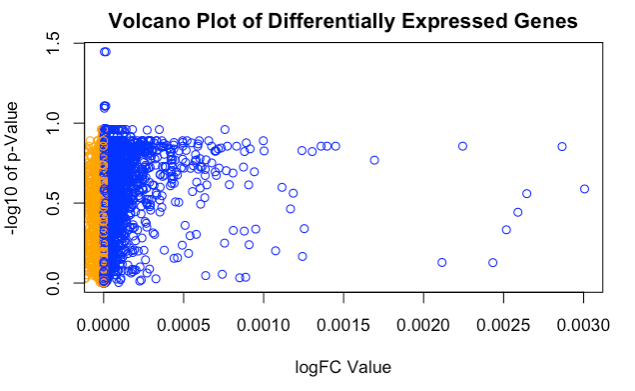
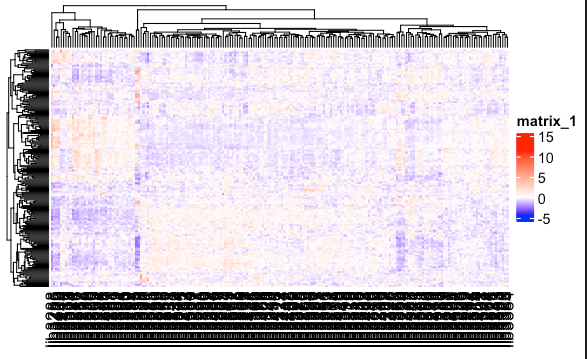
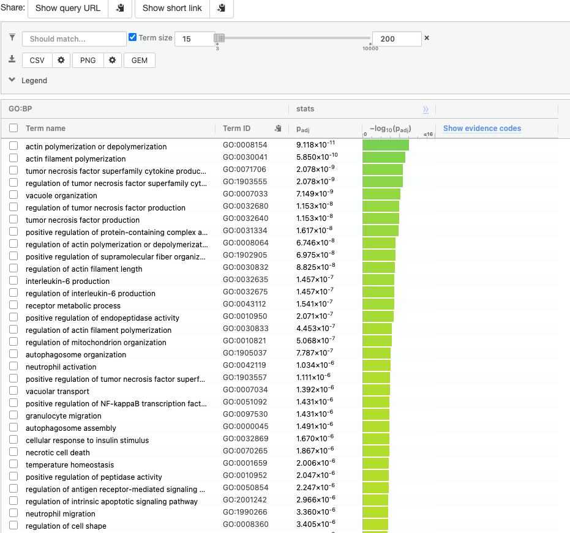
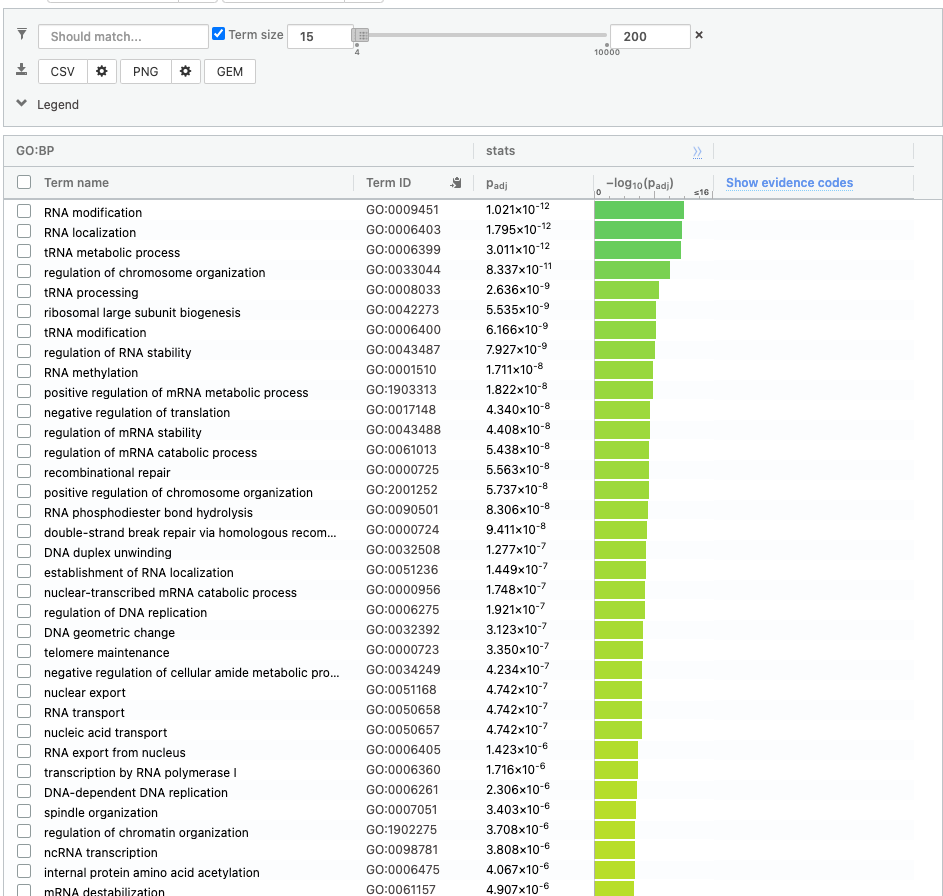
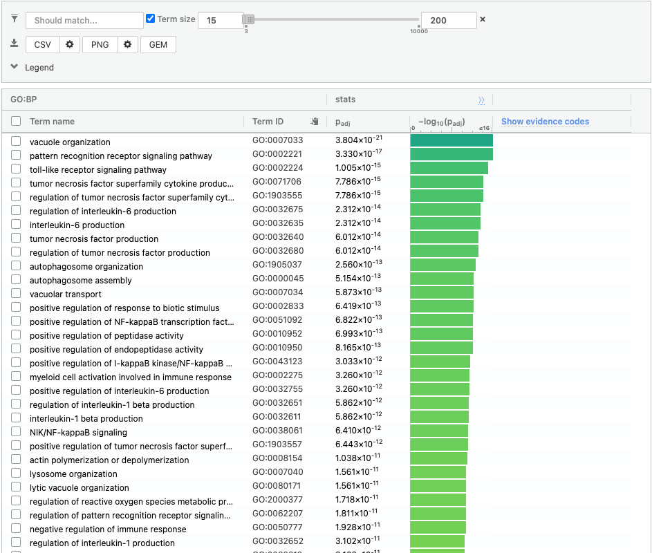

```{r setup, include=FALSE}
if (!requireNamespace("BiocManager", quietly = TRUE))
  install.packages("BiocManager")
if (! requireNamespace("biomaRt", quietly = TRUE)) {
  BiocManager::install("bioMaRt")
}
if (! requireNamespace("biobase", quietly = TRUE)) {
  BiocManager::install("biobase")
}
if (! requireNamespace("limma", quietly = TRUE)) {
  BiocManager::install("limma")
}
if (! requireNamespace("ComplexHeatmap", quietly = TRUE)) {
  BiocManager::install("ComplexHeatmap")
}
if (! requireNamespace("circlize", quietly = TRUE)) {
  BiocManager::install("circlize")
}

library(BiocManager)
library(knitr)
```

# Introduction


Ritumaxib is a drug traditionally used to treat cancers and autoimmune diseases. However, for diabetics, this drug may be used for this case as well [@tcell]. Previously, we obtained the normalized count data of GSE112594. This data, which contained ensembl gene ids was able to be used for analysis was normalized via TMM. A csv file was exported from assignment 1 and then imported here for further analyses. A big issue here is that this article [@tcell] does not include data on control patients are any information related to each patient. The normalized data, in fact, the raw data in the first place received [@geo] is made up of RNA-sequence data from multiple patients, with patients having multiple sequences to their name. No information is given on the control group. Therefore, the model is not based on this, but rather based on the amount of gene expression. 

# Differential Gene Expression

## Loading Data

Within Assignment 1, the write.csv() function allows us to export a csv file which will be the basis of the data from assignment 1, that we will analyze in this assignment. The function read.csv() allows us to read this file type and convert it for use. [@lec6]

```{r}
data <- read.csv("normalized.csv", sep=",", row.names=1, stringsAsFactors = FALSE)
kable(data[1:5,1:6], type="html")
```

## Getting P-Values

### Creating a Data Matrix

A data matrix was created and fitted. The samples is based on the sum of the expression per gene, and the model design is based on the gene id. Code was based on lecture 6 content [@lec6], [@limma]

```{r}
#Code was based on lecture 6 content. (Isserlin 2022)
samples <- data.frame(colSums(data[,-1]))
model_design <- model.matrix(~ samples$colSums.data....1.. )


expressionMatrix <- as.matrix(data[1:194])
x = ncol(expressionMatrix)

minimalSet <- Biobase::ExpressionSet(assayData=expressionMatrix)
fit <- limma::lmFit(minimalSet, model_design)
```


### Compute

Empirical Bayes was used to compute, and the (non-adjusted) P-values were given. [@lec6], [@limma]
```{r}
#Code was based on lecture 6 content. (Isserlin 2022)
fit2 <- limma::eBayes(fit,trend=TRUE)
topfit <- limma::topTable(fit2, 
                   coef=ncol(model_design),
                   number = nrow(expressionMatrix))
data <- cbind(rownames(data),data)
rownames(data) <- NULL
colnames(data) <- c(names(data))
colnames(data)[1] <- "ensembl_gene_id"
heatmap_matrix <- data[1:250,1:ncol(data)]
output_hits <- merge(data[,1:2],
                     topfit,
                     by.y=0,by.x=1,
                     all.y=TRUE)
output_hits <- output_hits[order(output_hits$P.Value),]
output_hits <- output_hits[-2]
kable(output_hits[1:10,],type="html",row.names = FALSE)

```


### Getting the P - Values

```{r, eval=FALSE}
length(which(output_hits$P.Value < 0.05))
length(which(output_hits$adj.P.Val < 0.05))
```
The number of p-values under 0.05 was 3278, and the number of adjusted p-values under 0.05 was 2.

## Multiple Hypothesis Testing


Here, Multiple Hypothesis testing was used to adjust the P-Values. Now, this also gives us a chance to see what the upregulated and downregulated genes are (by checking logFC values). This was also outputted so that it was easy to copy and paste into g:profiler's web interface.[@lec6] [@limma]

```{r, message=FALSE}
#Code was based on lecture 6 content. (Isserlin 2022)
model_design_pat <- model.matrix(
  ~ samples$colSums.data....1..)
#kable(model_design_pat[1:5,1:2],type="html")
fit_pat <- limma::lmFit(minimalSet, model_design_pat)

fit2_pat <- limma::eBayes(fit_pat,trend=TRUE)
topfit_pat <- limma::topTable(fit2_pat, 
                   coef=ncol(model_design_pat),
                   adjust.method = "BH",
                   number = nrow(expressionMatrix))


output_hits_pat <- merge(data[,1:2],
                         topfit_pat,by.y=0,by.x=1,all.y=TRUE)
output_hits_pat <- output_hits_pat[order(output_hits_pat$P.Value),]
output_hits_pat <- output_hits_pat[,-2]
kable(output_hits_pat[1:10,],type="html",row.names = FALSE)


#Down and upregulated Genes
downregulated = output_hits_pat$ensembl_gene_id[which(output_hits_pat$logFC < 0)]
upregulated = output_hits_pat$ensembl_gene_id[which(output_hits_pat$logFC > 0)]

#This only needs to be done once, which is why it is commented out
#write.csv(downregulated, file = "downregulatedGenes.csv")
#write.csv(upregulated, file = "upregulatedGenes.csv")

```

```{r, eval=FALSE}
length(which(output_hits_pat$P.Value < 0.05))
length(which(output_hits_pat$adj.P.Val < 0.05))
```

Number of P-values for both regular and adjusted were the same as above. Clearly, this should not be the case (unless things are perfect, which seems very unlikely). I hypothesize that this could be due to only some of the data getting merged - as if all of the data was being merged, this would be very computationally expensive. Also, perhaps my original model did not have enough data - and the sums were simply not enough. [@lec6]

## Volcano Plot

```{r, eval = FALSE, warning=FALSE, message=FALSE}

#Code was based on lecture 6 content. (Isserlin 2022)
#Volcano plot is logFC vs -log10(pvalue)

#Get data

logfc_df = output_hits_pat[c("ensembl_gene_id","logFC")]
log10_df = output_hits_pat[c("ensembl_gene_id", "adj.P.Val")]
log10_df$adj.P.Val = -log10(log10_df$adj.P.Val)
final_data <- merge(logfc_df, log10_df, by.x=1,by.y=1)

#Change Colour
final_data$colour <-"black"
final_data$colour[which(final_data$logFC < 0)] <- "orange"
final_data$colour[which(final_data$logFC > 0)] <- "blue"

#Plot

#Limited x to get rid of oultiers

plot(final_data$logFC, final_data$adj.P.Val, col=final_data$colour, xlab = "logFC Value", ylab = "-log10 of p-Value", main="Volcano Plot of Differentially Expressed Genes", xlim = c(0,0.003))

#This code seems to not work - legend is decribed in caption
# legend("topright", legend=c(""Downregulated", "Upregulated"),
#        col=c("orange", "blue"))
```
{width=50%}

Figure 1: A volcano plot showing logFC vs -log10(pvalue). Upregulated genes in blue are towards the right and downregulated are towards the left as expected. There are lots of genes that are of interest since that are near the top of the curve.There also is not a curve, which is interesting, as well as the high number of upregulated genes compared to downregulated. 

## Heatmap

```{r, eval = FALSE, warning=FALSE, message=FALSE}
#Code was based on lecture 6 content. (Isserlin 2022)
library(ComplexHeatmap)
library(circlize)
ht_opt$message = FALSE
suppressPackageStartupMessages(library(ComplexHeatmap))


heatmap_matrix <- data[1:250,1:ncol(data)]
rownames(heatmap_matrix) <- unique(data[1:250,1:ncol(data)]$ensembl_gene_id)
colnames(heatmap_matrix) <- colnames(data[1:250,
                        1:ncol(data)])
heatmap_matrix <- heatmap_matrix[,-1]


heatmap_matrix <- t(scale(t(heatmap_matrix)))
if(min(heatmap_matrix) == 0){
    heatmap_col = colorRamp2(c( 0, max(heatmap_matrix)), 
                      c( "white", "red"))
  } else {
    heatmap_col = colorRamp2(c(min(heatmap_matrix), 0,
        max(heatmap_matrix)), c("blue", "white", "red"))
  }
current_heatmap <- Heatmap(as.matrix(heatmap_matrix),
      show_row_dend = TRUE,show_column_dend = TRUE, 
      col=heatmap_col,show_column_names = TRUE, 
      show_row_names = FALSE,show_heatmap_legend = TRUE)


top_hits <- output_hits_pat$ensembl_gene_id[
  output_hits_pat$P.Value<0.05]
heatmap_matrix_tophits <- t(
  scale(t(heatmap_matrix[
    which(rownames(heatmap_matrix) %in% top_hits),])))
if(min(heatmap_matrix_tophits) == 0){
    heatmap_col = colorRamp2(c( 0, max(heatmap_matrix_tophits)), 
                             c( "white", "red"))
  } else {
    heatmap_col = colorRamp2(c(min(heatmap_matrix_tophits), 0,
      max(heatmap_matrix_tophits)), c("blue", "white", "red"))
  }
current_heatmap2 <- Heatmap(as.matrix(heatmap_matrix_tophits),
                           cluster_rows = TRUE,
                           cluster_columns = FALSE,
                               show_row_dend = TRUE,
                               show_column_dend = TRUE, 
                               col=heatmap_col,
                               show_column_names = TRUE, 
                               show_row_names = FALSE,
                               show_heatmap_legend = TRUE,
                               )
current_heatmap2

#NOTE: Legend code was ommitted due to it not working. Legend is in teh description.
```

{width=50%}

Figure 2: A heatmap with red being equal to upregulated genes and blue equal to downregulated. Note the high amount of clear upregulated genes, compared to the relatively low amount of downregulated located on the left. 

[@lec6] [@complexheatmap] [@circular]

# Threshold over-representation analysis

### Which method did you choose and why?

I chose g:profiler, due to the ease of use and how familiar I was with the homework assignment

### What annotation data did you use and why? What version of the annotation are you using?

I used GO biological process, Reactome, and WikiPathways. This is because these were the ones used in the homework assignment, and it showed similarity with the types of genes that were being used. 

### How many genesets were returned with what thresholds?

794 (GO:BP) + 43(Reactome) + 57 (WP) = 2632 genesets were returned. All thresholds were left at default, how the significance threshold chosen was Benjamini-Hochberg. 

{width=50%}

### Run the analysis using the up-regulated set of genes, and the down-regulated set of genes separately. How do these results compare to using the whole list (i.e all differentially expressed genes together vs. the up-regulated and down regulated differentially expressed genes separately)?

Down regulated: 320 (GO:BP) + 70 (REAC) + 17 (WP) = 407

{width=50%}

Up regulated: 1277 (GO BP) + 161 (REAC) + 112 (WP) = 1550

{width=50%}

# Interpretation

### Do the over-representation results support conclusions or mechanisms discussed in the original paper?


Yes, they do. Notice the high amount of upregulated genes compared to the downregulated when we compared them separately. When looking at the heatmap and the volcano plot that was done through our analyses from the original data, there is also a significant amount of upregulated genes as well. Due to this consistency, this does support mechanisms in the original paper. The paper also says how some of the sequences were also used for downregulated analyses. 


### Can you find evidence, i.e. publications, to support some of the results that you see. How does this evidence support your results.

Yes, several studies show some of the results I can see. Specifically, the amount/importance of upregulated genes. For example, this one study [@upreg] talks about how ritumaxib (the drug in the original article), combined with Gemcitabine treatment can help upregulate CD20 expression. Since we know ritumaxab has lots of upregulated genes related to it (due to the higher amount of hits with g:profiler and the high amount shown in the figure 1 and 2) we can see that treatment with another drug just confirms our results.  

# Journal Link

https://github.com/bcb420-2022/Aryan_Ahmad/wiki/Journal-5,-Assignment-2
