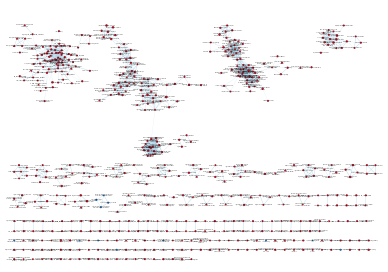
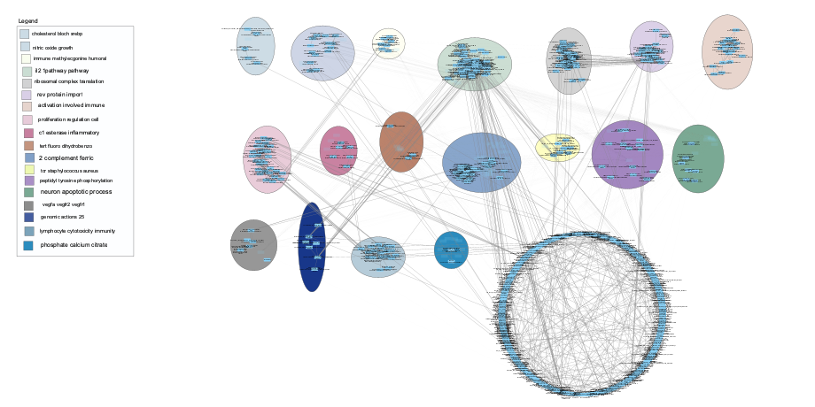
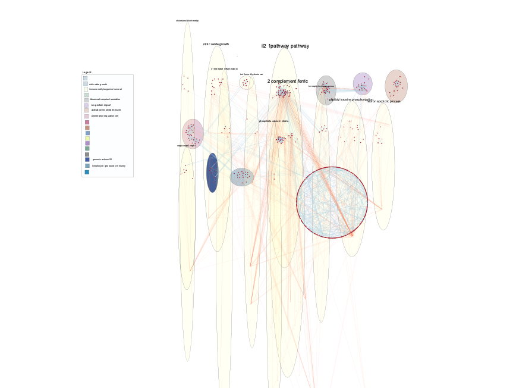
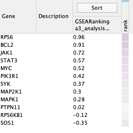

[@dplyr]
```{r setup, include=FALSE}
if (!requireNamespace("dplyr", quietly = TRUE))
  install.packages("dplyr")
library(dplyr)
```

## Introduction

Ritumaxib is a drug that is currently used for automimmunue disorders, although recently there has been testing done to see if it was possible that it could help with insulin stabilization with type 1 diabetic patients. The raw data was given, and with that we are able to provide initial normalization and processing, as well as do threshold over-representation analysis - which would be the main building blocks of this assignment, where our goal is to find pathways and create a network analysis. The results from previous assignments all build up off of one another, where the normalization in assignment 1 effected the threshold results in assignment 2, which of course can be used here

It is important to note that this original data did not have clear contorl/case groups outlined, so extra preprocessing needed to be done. Therefore, the initial results from assignment 1 and 2 would not be able to be properly used - the data had to be properly made with a control/case, run through assignment 1 and 2 code, before finally being able to use it here. More specifics are noted within the wiki


## Non-Threshold Gene set Enrichment Analysis

### What method did you use? What genesets did you use? Make sure to specify versions and cite your methods.

I used the GSEA application, specifically version 4.2.3 [@gseaapp]. I also used the Baderlab geneset that was used in the GSEA homework - this specific one is from March 2021 and contains GO biological processes, no IEA, and pathways [@bader].

### Summarize your enrichment results.

The top gene set for the `na_pos` results, which can be assumed as the case is `CXCR4`, with a p-value of 0.000, an ES of 0.72459, and a normalized ES of 3.9. The top geneset within here is PTPRC, or protein tyrosine phosphatase receptor type C.[@ptprc] There were 39 genes in the leading edge 

The top gene set for the `na_neg` results, which can be assumed as the control is `ARTERY DEVELOPMENT%GOBP%GO:0060840`. This had a P-value of 0.00317, higher than above, an enrichment score of -0.6594, and a normalized ES score at -0.65939. There were 16 genes in the leading edge, with the top being HECTD1, or HECT domain E3 ubiquitin protein ligase 1. [@hectd1]

### How do these results compare to the results from the thresholded analysis in Assignment #2. Compare qualitatively. Is this a straight forward comparison? Why or why not?

Of course, since I had issues with the original assignment 2, they could not be properly compared and therefore comparisons would have not made any sense. However, I managed to properly do a threshold analysis as I was building up my assumed case and control groups. 

With the code below, we can see that P-values, a common value do not align. This isn't really a straight forward comparison - based on what we have it does not make sense that we can compare them that way, considering they also belong to 2 different groups as well and that is not captured in this value. However, even with this, it is worth to note that these genes do in fact show up, and their P-values do make sense when compared to each other within the dataframes, but when comparing it to the GSEA output. 

```{r}
#Try to see if top genes are present in the a2 data
thres<-read.csv("threshold_data")
#control
thres %>% filter(hgnc_symbol == "HECTD1")
#case
thres %>% filter(hgnc_symbol == "PTPRC")
```

## Visualize your Gene set Enrichment Analysis in Cytoscape

### Create an enrichment map - how many nodes and how many edges in the resulting map? What thresholds were used to create this map? Make sure to record all thresholds. Include a screenshot of your network prior to manual layout.

There are 574 nodes, with 1725 edges.

Thresholds include: FDR q-value cut off of 0.01, and selecting filter genes by expressions. Number of edges was default - and everything was default after inputting my GSEA results folder. [@cytotut]

{width=50%}


Figure 1: Before any manual review, this was the outputted gene set enrichment analysis

### Annotate your network - what parameters did you use to annotate the network. If you are using the default parameters make sure to list them as well.Make a publication ready figure - include this figure with proper legends in your notebook.

Annotations were added via the autoannotate application within cytoscape, which made the job very easy. [@autoannotate]. A new annotation set was created with a grid network, which was the MCL cluster algorithm, with the WordCloud label algorith, and 3 max words per label. To reduce cluttering, any cluster with under 7 nodes were removed, and a publication ready figure was created. 

{width=50%}


Figure 2: An annotated network using cytoscape, EnrichmentMap, and AutoAnnotate. About 18 different clusters can be seen here, with oen of the largest being 2 complement ferric.

### Collapse your network to a theme network. What are the major themes present in this analysis? Do they fit with the model? Are there any novel pathways or themes?

The largest themes are the il2 pathway, and ribosomal complex translations. This does fit with the model, as the IL-2 pathway is an essential pathway of T-cell differentiation. A novel theme her e is 2 complement ferric, which leads to some papers about the role if Iron in Type 1 1 diabetes - a core aspect of this original paper. [@iron]


## Interpretation

### Do the enrichment results support conclusions or mechanism discussed in the original paper? How do these results differ from the results you got from Assignment #2 thresholded methods

The enrichment results talk the IL-2 Signalling pathway, which as we know is involved in T cells and plays a part in T-cell activation, and the article talks about T-cell Receptor pathway as well. Also, co-stimulation was talked about - therefore I had the idea of searching for CD28 pathways, where I got results within the enrichment path - with many nodes connected and starting from the IL2 pathway annotation. I decided to run this again after the pre-processing in the next slide, and got a cleaner results, and I could see how it also connected to the peptidyl tyrosine phosphorylation group. 

When comparing to the old thresholded methods, there was not much similarity. This was due to the fact that assignment 2's thresholding, especially the later part of the assignment was not able to be done since there was a lack of control/case. After it was done, the threshold results had genes which were etop hits of the heatmap shown in cytoscape. 

### Can you find evidence, i.e. publications, to support some of the results that you see. How does this evidence support your result?

Yes. One publication talks about the role of iron and its factors of the risk of type 1 diabetes [@iron]. This evidence supports my results, because after I made my map I was quite confused why there wa a "ferric" annotation. Therefore, this lead me to search online for results of iron and Ritumaxib, or iron and type 1 diabetes, where the latter had results as outlined in this publication.

### Add a post analysis to your main network using specific transcription factors, microRNAs or drugs. Include the reason why you chose the specific miRs, TFs or drugs (i.e publications indicating that they might be related to your model). What does this post analysis show?

{width=50%}


Figure 3: A post analysis of my main network, in grid style, using the 'Human_DrugBank_approved_symbol` geneset

The reason I chose this because Ritumaxib, the drug in question in this paper [@og],is an approved drug by the FDA for use in autoimmune disorders - such as rheumatoid arthritis.[@fda]. As seen above, there is much geneset overlap actually can be seen in the annotated legend above - such as the IL2 pathway, 2 complement ferric. Therefore, this post analysis shows other drugs that behave either similarily or also target similar processes to Ritumaxib - whether that is T1D or autoimmunue diseases.  

In a heatmap, it can be seen the highest rank is for hte RPS6 gene, which is a part of the ribosomal subunit [@rps6] - this makes sense, since in many allowed drugs, shown above, antibiotics are one of them, which are known to target antibiotics [@ribosome]. However, no connection to the ribosome was found in the original paper - in fact, the other highest gene, BCL2 [@bcl2], repsonsible for aptopsis, wasn'nt present anywhere either. 


{width=50%}


Figure 4: A heatmap after post processing


